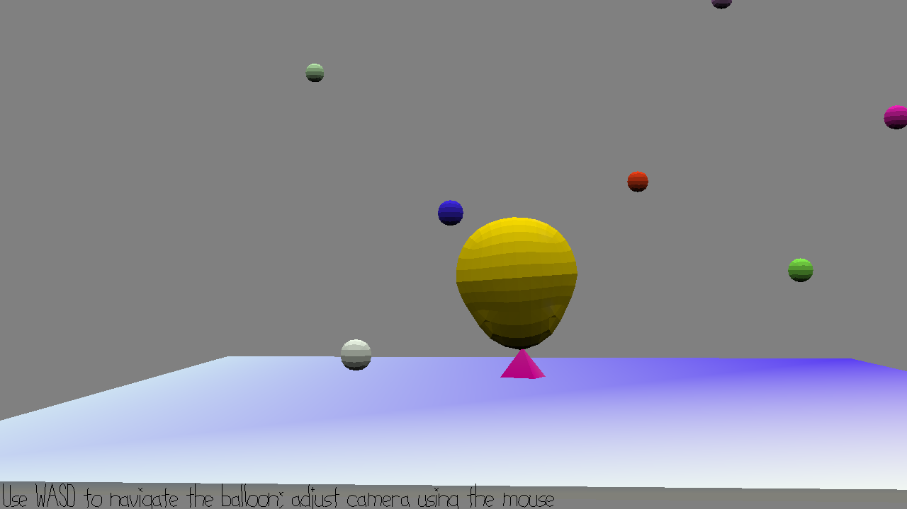

# Analogy Simulator 

Author: Xinyi Sun

Design: This game elucidates a subtle analogy between balloon and...something else.

Screen Shot:

How To Play:

Use WASD to control the movement of the balloon. Use mouse to adjust camera view (not necessarily helpful though). The floating balls are there to inflate the balloon so that it goes up higher. The goal is to reach the needle at the top of the balloon.

Sources: As you've probably noticed my assets are named "shabby.\*". Not necessarily the best assets but I did create them myself.

This game was built with [NEST](NEST.md).

